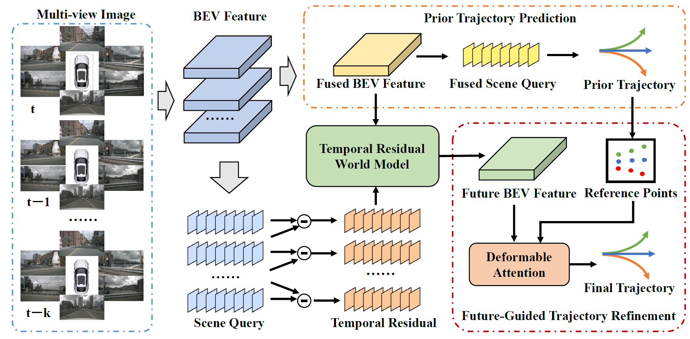

<div align="center">
<h1>ResWorld</h1>
<h3>[ICLR2026] ResWorld: Temporal Residual World Model for End-to-End Autonomous Driving</h3>
</div>

<div align="center">
  
</div><br/>

## Main Results

### UniAD-style metrics
| Method | L2<sub>MAX</sub> (m) 1s | L2<sub>MAX</sub> (m) 2s | L2<sub>MAX</sub> (m) 3s | L2<sub>MAX</sub> (m) Avg. | CR<sub>MAX</sub> (%) 1s | CR<sub>MAX</sub> (%) 2s | CR<sub>MAX</sub> (%) 3s | CR<sub>MAX</sub> (%) Avg. | 
| --- | --- | --- | --- | --- | --- | --- | --- | --- |
| ResWorld | 0.19 | 0.50 | 1.08 | 0.59 | 0.02 | 0.06 | 0.43 | 0.17 | 

### VAD-style metrics
| Method | L2<sub>AVG</sub> (m) 1s | L2<sub>AVG</sub> (m) 2s | L2<sub>AVG</sub> (m) 3s | L2<sub>AVG</sub> (m) Avg. | CR<sub>AVG</sub> (%) 1s | CR<sub>AVG</sub> (%) 2s | CR<sub>AVG</sub> (%) 3s | CR<sub>AVG</sub> (%) Avg. |
| --- | --- | --- | --- | --- | --- | --- | --- | --- |
| ResWorld | 0.14 | 0.27 | 0.49 | 0.30 | 0.01 | 0.03 | 0.14 | 0.06 |

## Get Started

#### 1. Please follow these steps to install ResWorld.

a. Create a conda virtual environment and activate it.
```shell
conda create -n resworld python=3.8 -y
conda activate resworld
```

b. Install PyTorch and torchvision following the [official instructions](https://pytorch.org/).
```shell
pip install torch==1.9.1+cu111 torchvision==0.10.1+cu111 torchaudio==0.9.1 -f https://download.pytorch.org/whl/torch_stable.html
```

c. Install mmcv-full, mmdet and mmseg.
```shell
pip install mmcv-full==1.4.0
pip install mmdet==2.14.0
pip install mmsegmentation==0.14.1
```

d. Install mmdet3d
```shell
git clone https://github.com/open-mmlab/mmdetection3d.git
cd /path/to/mmdetection3d
git checkout -f v0.17.1
python setup.py develop
```

e. Install nuscenes-devkit.
```shell
pip install nuscenes-devkit==1.1.9
```

#### 2. Prepare nuScenes dataset as the below folder structure:

```
GeoBEV
├── data
│   ├── nuscenes
│   │   ├── lidarseg
│   │   ├── maps
│   │   ├── samples
│   │   ├── samples_point_label
│   │   ├── sweeps
│   │   ├── v1.0-test
|   |   ├── v1.0-trainval
│   │   ├── vad_nuscenes_infos_temporal_train.pkl
│   │   ├── vad_nuscenes_infos_temporal_val.pkl
```
a. Download nuScenes 3D detection data [HERE](https://www.nuscenes.org/download) and unzip all zip files.


b. Download the [train](https://drive.google.com/file/d/1OVd6Rw2wYjT_ylihCixzF6_olrAQsctx/view?usp=sharing) file and [val](https://drive.google.com/file/d/16DZeA-iepMCaeyi57XSXL3vYyhrOQI9S/view?usp=sharing) file generated by VAD.


c. Download nuScenes-lidarseg annotations [HERE](https://www.nuscenes.org/download) and put it under `data/nuscenes/`. Create depth label utilized by GeoBEV from point cloud by running:
```shell
python tools/generate_point_label.py
```

#### 3. Train ResWorld model on nuScenes:
Download the backbones pretrained by GeoBEV [HERE](https://drive.google.com/file/d/1B8Bz4_CpHGjgBrD84JbBJrAtx4TOnUG0/view?usp=sharing) and put it under `ckpts/`. Then train the ResWorld model following:
```shell
bash tools/dist_train.sh projects/configs/resworld/resworld_config.py 4
```
#### 4. Evaluate ResWorld model following:
```shell
bash tools/dist_test.sh projects/configs/resworld/resworld_config.py work_dirs/resworld_config/epoch_12_ema.pth 4 --eval bbox
```
The model after training is available [HERE](https://drive.google.com/file/d/12mlspkNBLhMrwpRZJGlC4hfWU07Yt9V9/view?usp=sharing).

## Acknowledgement

This project is not possible without multiple great open-sourced code bases. We list some notable examples below.

- [BEVDet](https://github.com/HuangJunJie2017/BEVDet)
- [VAD](https://github.com/hustvl/VAD)
- [SSR](https://github.com/PeidongLi/SSR)